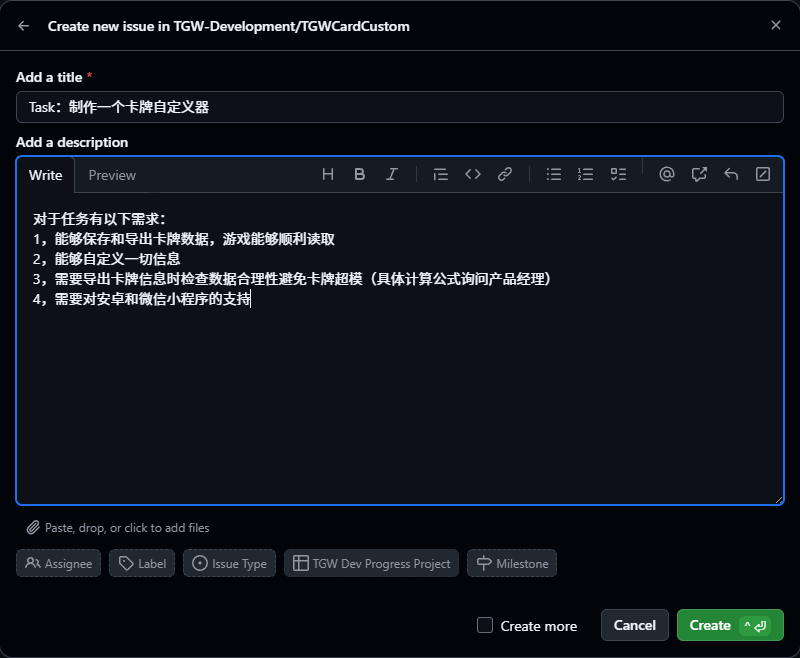

# 开发流程
- [需求交接](#需求交接)
- [需求对接](#需求对接)
- [开发进行中](#开发进行中)
- [提交代码](#提交代码)
- [代码审查](#代码审查)
- [需求重做](#需求重做)
- [合并代码](#合并代码)
- [结束任务](#结束任务)
- [放弃任务](#放弃任务)

> ## 需求交接
>
> 在最开始，团队内商策出一个开发需求后，经**产品经理**转接给程序部
> 任务借助Github的Project发布任务内容
>
> 首先，在组织Project中找到对应的Project表，进入后，在```Tasks and bugs```白板栏中的```待接受的任务```中点击```Add item```添加一个Issue，创建Issue时，请注意所投放的Issue的目标仓库，不要错投仓库。
>
> 产品经理填写Issue标栏时，需要简洁明了的描述任务大概，细节内容标栏下的```Add a description```选项卡中具体描述，若需求需要与程序员当面对接，需要写明特殊的对接请求。
>
> 产品经理填写需求时，建议将需求细分，不要一次性屯过多需求，会导致压力一边倒
>
> 产品经理在发布任务时，需要注意发布的**格式**
>   - 针对的是**开发任务**（功能的增加或变更等）需要以```Task：```为前缀表明
>   - 针对的是测试反馈或玩家反馈的**Bug问题**，需要以```Bug：```为前缀标明
> 例子：
> 
> 


> ## 需求对接
> 程序员们在一般情况下，在Project中```Tasks and bugs```选项卡中的```待接受的任务```领取任务。选取合适的任务后，点击白板上的Issue卡片，并在弹出的Issue详情页中仔细阅读任务需求/Bug反馈现象，在下方```Add a commit```中以格式写下```xxx已领取任务```确定任务。这一步十分关键，因为这样子避免多个程序员同时进行一个任务，只需阅读最新的一条Commit就能迅速了解当前任务的状态。高效！
>
> 一个程序员可以接多个任务，但是不推荐过多，导致项目压力一边倒，拖延项目进度
>
> 工作室项目管理人员定时上线检查调节Issue卡片的状态。当然，你也可以对Issue卡片进行处理后调一下相应的位置，但切记要调整到正确的位置
>
> 领取对应任务的程序员需要```fork```对应的仓库到自己账户下，**不能对仓库直接操作！！！**
> **不能对仓库直接操作！！！！！！**


> ## 开发进行中
>
> 程序员fork仓库代码后，建议创建一条合适的分支并复制适合分支的代码，对自己账户下的仓库进行操作，**禁止对组织原仓库进行直接提交代码和操作**。
>
> 默认情况下，组织成员不具有直接推送代码到原仓库的权限
>
> 需要注意的是，本地仓库```pull```同步远程仓库时，统一使用```--rebase```参数，该操作的目的是为了保证提交历史树更干净
>
> 开发者必须按照开发准则


> ## 提交代码
> 提交代码通过提交```Pull request```的方式提交，需要先上传你的本地代码到你的fork仓库下，保证代码为最新。接着，你就可以提交一个```Pull request```到组织原项目仓库的```dev```分支下
>
> **注意：提交的目标分支是dev而不是main**
>
> 提交时，请**仔细写明**代码的**修改内容**，**标注Issue**的代码
>
> 提交代码后并非一劳永逸，需要等待code reviewer和其它管理员对你所负责的Issue内容的处理，不幸的情况下，你的pull request会被回退并根据code reviewer提供的信息修改你的代码
> 提交完你的代码后，记得将Issue卡片移到```完成并审核中```一栏下，方便```code reviewer```及时发现你的合并请求并及时审核你的代码


> ## 代码审查
> 代码审查的工作由```code reviewer```来进行，每个仓库的code reviewer不同，具体看主要负责的人是谁，多数情况下是仓库创建者和当前仓库管理员。
>
> code reviewer需要拥有较高的代码水平，代码审查过程中需要仔细阅读更改的代码，并且处理合并需求
>
> code reviewer在审查过程中需要注意几点：
> - **代码是否符合项目规范**
> - **代码是否没有存在bug**
> - **代码是否注释全备**。
> 
> 若代码不符合要求，直接拒绝其Pull request并返回不符合的信息点


> ## 需求重做
> 根据代码审查的内容来看，是否达到代码规范要求，如果不符合要求，则根据上一点中拒绝合并的操作进行
> 需求被退回后，```code reviewer```需要手动将```Issue```卡片移至```正在处理中……```，表示需求退回重做


> ## 合并代码
> 合并代码是由```code reviewer```来进行的
>
> 在合并来自其它开发者的代码时，需要关注合并内容的几个方面：
> - **代码提交的内容是什么**（这一点需要开发者在提交时写明）
> - **提交的代码是否符合规范**
> - **代码所对应的Issue要求是什么**
> - **合并目标分支是否为dev或其它非main分支**
>
> 一切无误后合并代码到dev分支上
>
> 若合并的原因是将**dev**分支合并到**main**分支上，属于版本更新合并，需要在合并信息中表示版本更新和标注版本号，这也是为什么不直接提交代码到main分支的原因。
>
> ```dev```分支主要是作为**开发任务整合**，开发进度到一定时，再合并到```main```分支中，**发布软件产品**也是发布main分支上的产品信息


> ## 结束任务
> 合并代码后，```code reviewer```需要**关闭**相应的**Issue**卡片，并提交任务已完成的信息
> Issue卡片被关闭后，会自动移至```已解决的问题Cheer！```卡片栏下


> ## 放弃任务
> **放弃任务有三种原因**：一是由于**任务实现存在技术难度**（可能出自程序员本身或者需求本身）；二是需求修改**不在需要该任务实现**；三是领取该任务的**开发者进度过慢，团队急需转出需求**让更适合的开发者担任该任务提高开发效率
>
> 若开发者认为**因个人实力该方案无法进行，选择转让任务**，需要在对应的任务Issue中```提交Commit```表示自己无法完成任务。若任务已有进度，可以根据代码的质量自己评估是否需要提交，需要提交的话，需要提交```Pull request```并补充说明提交的理由是放弃任务
>
> 若**开发任务被取消**，代码不需要提交，销毁fork仓库或分支即可。通知```code reviewer```或管理员或自己**关闭**相应**Issue**卡片，关闭前请提交取消任务的信息，并讲Issue卡片移至```取消或无法完成```选项栏下
>
> 若领取任务的开发者**因个人开发效率问题需要转交任务**，需要先提交```Pull request```交付代码进度后再在```Issue```卡片上表示取消任务，让Issue成为自由可接的状态