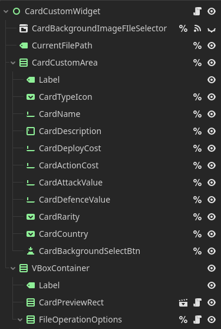

# 文件管理规范
> 梗概：本页手册详解了对于不同类型的项目的文件树设计与文件树设计规范等等

## 内含项目列表
- [文件管理规范](#文件管理规范)
  - [内含项目列表](#内含项目列表)
- [Godot项目树](#godot项目树)
- [Web项目树](#web项目树)

# Godot项目树
- 对于最基本的文件树来说，有[资源Assets](#资源assets)，文档Docs，[场景Scene](#场景scenes与脚本scripts)，[脚本Scripts](#场景scenes与脚本scripts)    
- 对于文件夹来说，统一使用帕斯卡命名法（PascalName），即单词以首字母大写拼接命名，并使用名称复数形式
- 对于存放不同类的文件夹来说内部按```所属者```/```功能```/```大类```进行分类，例：
> ```mermaid
> graph TD
>   A[Images] ---> B[UITextures]
>   A[Images] ---> C[Card]
>   C ---> D[TypeIcons]
>   C ---> E[ArmyFlagIcons]
>   C ---> ...
>   B ---> F[CardListSurfaces]
>   B ---> G[...]
> ```
> 解释：
> 在本图中，Card文件夹以资源```所属者```Card划分子文件夹，包含卡牌类图标和军队旗帜图标
> UITextures文件夹则以资源```大类```UITexture（UI表面贴图）划分，内包含CardListSurface（牌列表面贴图）和其它

> ## 资源Assets：
> 资源总体上来说，可以分为**图像**，**音频**，**字体**，Godot的**Resource继承资源**，**控件主题**，他们对应的文件夹名称为**Images**，**Audios**，**Fonts**，**Resource**，**Themes**
>
> 若还有其它类型的资源，若该资源是来自Godot引擎的资源类型，则使用该资源文件名称为文件名  
> 例：存放Godot中的动画资源**Animation**则命名存储动画资源的为**Animation**，内部的文件按照动画的`归属者+动画名/动画功能`的命名方案来命名
>
> **Resource**文件夹中，用于存放自定义的文件数据，比如官方设计的默认卡牌数据包，自定义的配置文件资源，玩家存档资源等（按需考虑是否要放在游戏里一起打包，比如玩家存档就可以存放在user://路径下会更好）。
>
> ## 场景Scenes与脚本Scripts:
> 
> 
> - ### 场景与脚本目录结构同步对应
> 场景文件存在于Scenes文件夹中，而脚本文件存在于Scripts文件夹中，此处的目录结构对应这个概念，接下来慢慢分析
>
> 虽然一个节点只能挂载一个脚本，一个场景也存在一个根节点，多数情况下我们不会将全部逻辑内容写在一个脚本文件中，这样会很臃肿，很复杂。所以，我们鼓励将一个场景中的逻辑内容拆分至多个脚本中，分而治之。
>
> 图例（取自25.8.1自定义制卡器一段节点树）：
> 
>
> 如图所示，该场景中包含多个子节点的脚本，他们多数是为当前场景服务的专职脚本，所以和父节点/当前场景有深依赖关系。依照这层关系，我们可以在脚本目录中创建一个与场景同名的文件夹，将该场景中全部父节点，子节点的脚本文件归置在该文件夹中。
> 多说无益，还得是图表出手：
>
> ```mermaid
> graph TD
> Scenes ---> SceneA.tscn
> ```
>
> 那么在Scripts文件夹下，应该有对应的文件结构层次
>
> ```mermaid
> graph TD
> Scripts ---> SceneA
> SceneA ---> ScriptAForSceneA.gd
> SceneA ---> ScriptBForSceneB.gd
> SceneA ---> ScriptCForSceneC.gd
> ```
>
> 这个方法有利于形成对应关系，方便寻找对应的相关脚本，而不用对着文件管理器中反复嵌套的文件大发雷霆

# Web项目树